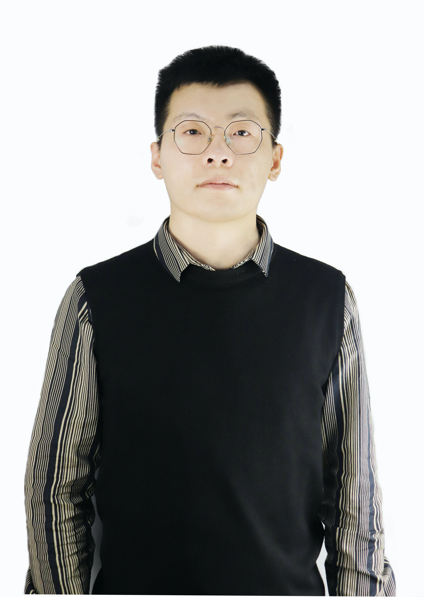

# About Me

<!--  -->

Here is **Zhiqiang Lv (吕志强)**.

I hold a PhD in Software Engineering from Qingdao University. Currently, I am working at the [Institute of Computing Technology of the Chinese Academy of Sciences](http://www.ict.ac.cn/) and [Qingdao University](https://www.qdu.edu.cn/). I also hold concurrent positions as the Director of the Research and Development Center at [PerfXLab (Beijing) Technology Co.](https://perfxlab.cn), Ltd., the Deputy Director of the Internet Software Innovation Center in Qingdao, China, and as a consultant for the High-Performance Computer Cluster at the Weihai Innovation Institute.

If you are interested in any aspect of me, I would love to chat and collaborate, please email me at - *lvzhiqiang@ubinet.cn*

## Academic Background

- **Sep 2023 - June 2024:** Qingdao University (PhD) & Institute of Computing Technology of the Chinese Academy of Sciences (Jointly-trained PhD)
- **Sep 2019 - June 2023:** Qingdao University (Master) & Institute of Computing Technology of the Chinese Academy of Sciences (Jointly-trained Master)
- **Sep 2015 - June 2019:** Ludong University (Bachelor)

---

## Research Interests

- Internet of Everything
- Cyber-Physical System
- Industrial Informatics
- Applied Machine Learning
<!-- - [My latest research proposal (Dec 2023)](https://caihanlin.com/file/proposal-2023.pdf)🔗 -->

My current research focuses on practical problems that artificial intelligence faces in real life. My interests are on the **Machine Learning** and its applications in **Industrial IoT**. In a word, advanced technologies like ML and IoT positively influence the life of everybody.  I wish to devote my talent to this meaningful cause and bring well-being to society.

---

## News and Updates

- **May 2024：**My undergraduate thesis won the Best Project Award (Top 1/300) 🎉
- **April 2024：**Our work *BLEGuard* has been accepted to [MobiSys 2024](https://www.sigmobile.org/mobisys/2024/) as a poster paper. See you in Japan!
- **March 2024：**Very excited to get a MPhil offer from Engineering department at Cambridge University!
- **Dec 2023：**Very excited to be selected as [AAAI-24 UC Scholar](https://aaai.org/aaai-conference/undergraduate-consortium-program/). See you in Canada!
- **Dec 2023：**Got a MSc offer from the physics department of Imperial College London.
- **Aug 2023：**Happy to be awarded the FEPG Scholarship.
- **May 2023：**Happy to be awarded the XiamenAir Scholarship.
- **May 2023：**Collected the Finalist Award in MCM 2023 (Top 1%).
- **Jun 2022：**Started research programme at [Cambridge AI Group](https://www.cl.cam.ac.uk/research/ai/), advised by Prof. Pietro Liò.

<!-- <blockquote class="twitter-tweet">
Thrilled to be an AAAI-UC Scholar at <a href="https://twitter.com/hashtag/AAAI24?src=hash&amp;ref_src=twsrc%5Etfw">#AAAI24</a>, thanks to <a href="https://twitter.com/hashtag/AAAI?src=hash&amp;ref_src=twsrc%5Etfw">#AAAI</a> &amp; <a href="https://twitter.com/hashtag/GoogleExploreCSR?src=hash&amp;ref_src=twsrc%5Etfw">#GoogleExploreCSR</a> for the sponsorship. Grateful for the knowledge gained and new friendships formed.  Wonderful trip in Vancouver. Looking forward to staying connected with all.<a href="https://twitter.com/hashtag/AAAI24?src=hash&amp;ref_src=twsrc%5Etfw">#AAAI24</a> <a href="https://twitter.com/hashtag/Vancouver?src=hash&amp;ref_src=twsrc%5Etfw">#Vancouver</a> <a href="https://twitter.com/hashtag/GoogleExploreCSR?src=hash&amp;ref_src=twsrc%5Etfw">#GoogleExploreCSR</a> <a href="https://t.co/wUQUp8XlSM">pic.twitter.com/wUQUp8XlSM</a>
&mdash; Hanlin CAI (seeking a PhD position 2025) (@lancecai2002) <a href="https://twitter.com/lancecai2002/status/1762210025173344260?ref_src=twsrc%5Etfw">February 26, 2024</a></blockquote>  -->

